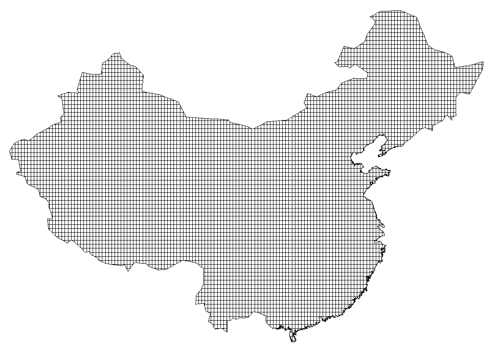
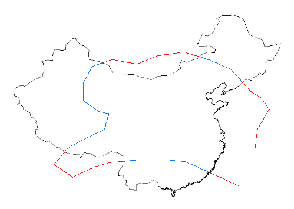
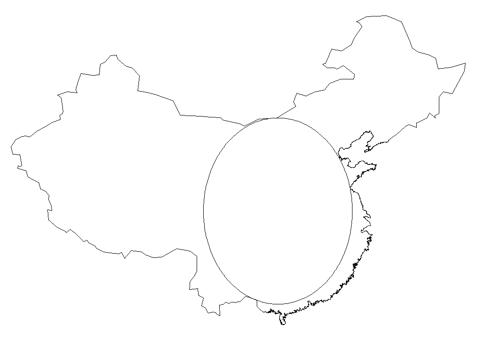

NC-GEO
======

**nc-geo** is a collection of super-fast algorithms for geometry processing(Polygon splitting, finding the largest circle in a polygon, etc.)

Features
--------

* Very efficient.

  For instance, ``PolygonTileSplitter`` can split the China's silhouette (19893 points) into approximate 1 square km tiles in lesss than 2 seconds, 
  resulting more than 9500000 polygons.
  It's serveral hundred times faster than GPC_.

* Well designed and easy to use.
* Well tested.
  
  It's tested with `Google Test Framework`_. And it's widely used in our commercial map data compilers.

.. _GPC: https://en.wikipedia.org/wiki/GPC_General_Polygon_Clipper_Library
.. _Google Test Framework: https://github.com/google/googletest

In This Project
---------------

Polygon/polyline algorithms
...........................

* `PolygonTileSplitter` - Split polygon by equal-sized grids.

* `PolylineTileSplitter` - Split polyline by equal-sized grids.
* `PolylinePolygonSplitter` - Split polyline into segments with a given polygon.

* `PolygonMarker` - Find the largest inscribed circle in polygon.

* `PolygonMerger` - Given a set of polygons, remove their common edges(exactly same edge).

Generic containers and utilities
................................

* Vector
* Hashmap
* SmallObjectAllocator

Basic gometry types and their operatoions
.........................................

* Point

  Representation of 2D integer point.

* Rect

  Representation of 2D integer rectangle.

* StaticPolygon

  A collection of ``Points`` to represent the contour of a polygon, inmutable after creation.

* MutablePolygon

  Similar to ``StaticPolygon``, but adding or removing points is allowed.

Usage
-----

Each algortihm has a coresponding unit test, you can get its usage by reading testing code. All unit tests of these classes are in ``test``. For instance ``PolygonTileSplitter``:

.. code-block:: cpp

   PolygonTileSplitter* splitter = new PolygonTileSplitter();

   Point points[3] = { {0, 0}, { 100, 0 }, { 0, 100 } };
   StaticPolygon polygon;
   polygon.initWithPointsNoCopy(points, 3);

   splitter->setTileSize(50);
   int num;
   StaticPolygon** pieces = splitter->split(&polygon, &num);

Just a few lines of code.
